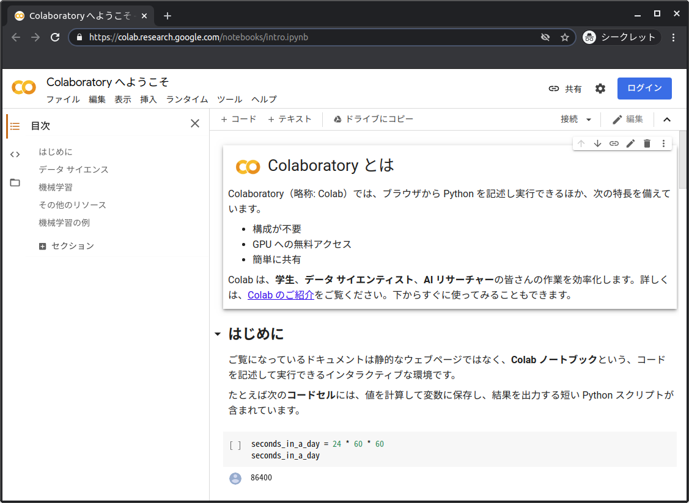
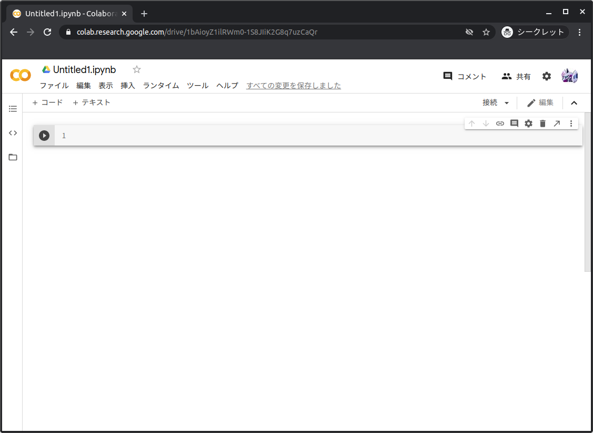
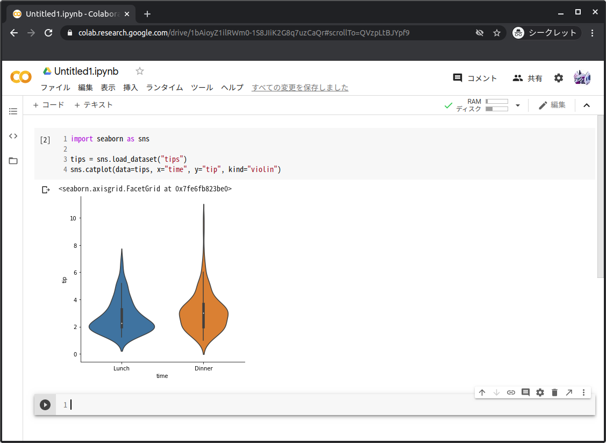
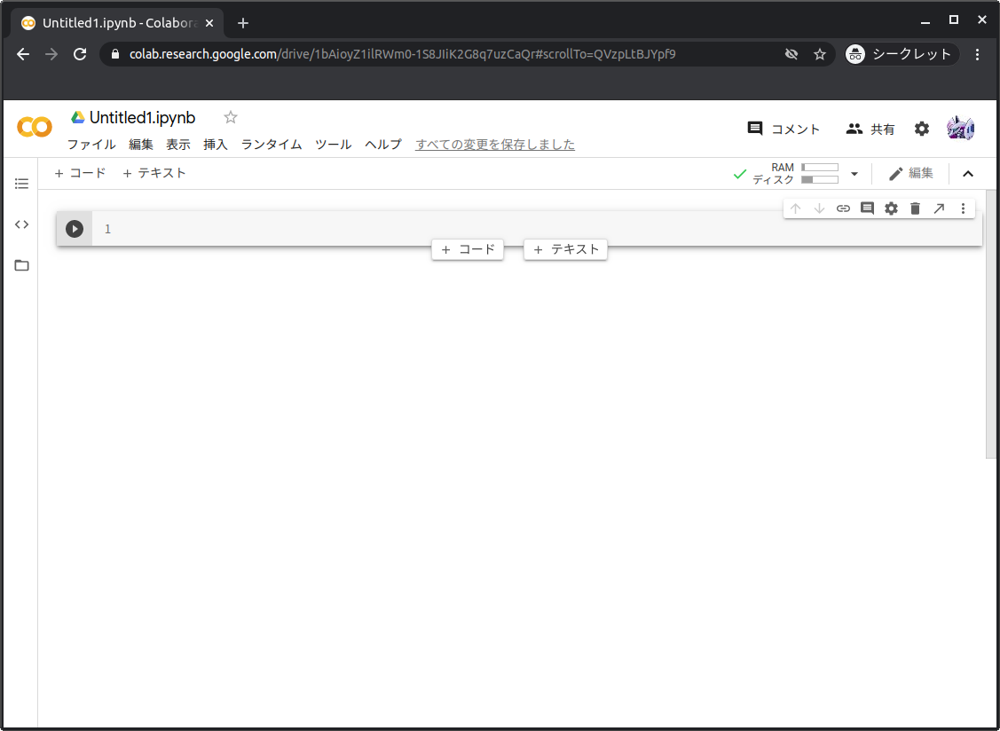
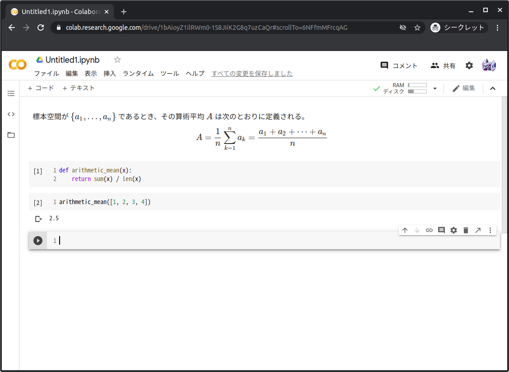

Google Colaboratory入門
=======================

Colaboratoryとは
----------------

Colaboratory（略称: Colab）ではブラウザからPythonを記述し実行できるほか、Markdown形式によるテキストを記述し、表示ができるサービスです。コードと実行結果およびテキストはノートブック（.ipynb）という形式に保存され、容易に共有できます。クラウド上に環境が用意されているため、ユーザは実行環境を用意することなく、すぐにPythonを実行できます。また、あらかじめデータ分析に必要なライブラリがインストールされており、環境構築を手間がかからないのも利点のひとつです。

Colaboratoryの使い方
--------------------

早速、Colaboratoryを使ってみましょう。ブラウザから次のリンクにアクセスします。

https://colab.research.google.com/

Googleアカウントによるログインを行っていない場合には「ログイン」ボタンよりログインし（ :numref:`colab_not_login` ①）、「ノートブックを新規作成」を選択します（ :numref:`colab_recent` ②）。

   未ログイン時の画面

.. figure:: ./images/colab_recent.png
   :name: colab_recent

   Colaboratoryの初期画面

ノートブックが作成され、このノートブックにコードやテキストを記述できます（ :numref:`colab_new_notebook` ）。

   新規ノートブック

作成されたノートブックは名前の変更ができます。ノートブック名を変更するには :numref:`colab_new_notebook` ③の「Untitled1.ipynb」を任意の名前に変更します。

:numref:`colab_new_notebook` ④はコードセルと呼ばれ、Pythonのコードが実行できます。コードセルに :numref:`sample_code` のコードを記述し、実行してみましょう。 コードの実行は :numref:`colab_new_notebook` ⑤のボタンをクリックするか、「Shift+Enter」または「Ctrl+Enter」を入力します。

.. code-block:: python
   :name: sample_code
   :caption: Pythonのコードのサンプル

   import seaborn as sns

   tips = sns.load_dataset("tips")
   sns.catplot(
    data=tips, x="time", y="tip", kind="violin"
   )

コードセルを実行すると :numref:`colab_run_code` のようにノートブックにグラフが埋め込まれます。このようにノートブックにコードと実行結果を保存することで、あとで読み返したり、第三者に共有するのに便利です。

コードセルを追加するには :numref:`colab_new_notebook` ⑥をクリックするかセルの上下にカーソルを移動し、「＋ コード」をクリックします（ :numref:`colab_cell` ）。

   Pythonコードを実行

   セルの追加

次にテキストセルにテキストを記述します。テキストセルを作成するには :numref:`colab_new_notebook` ⑦をクリックするかセルの上下にカーソルを移動し、「＋ テキスト」をクリックします（ :numref:`colab_cell` ）。
テキストセルに :numref:`sample_text` のように記述し、実行すると数式が表示されます [#算術平均]_ 。

.. code-block:: none
   :name: sample_text
   :caption: テキストのサンプル

   標本空間が $\{a_1, \dotsc, a_n\}$ であるとき、その算術平均 ${\displaystyle A}$ は次のとおりに定義される。

   $$A = \frac{1}{n}\sum_{k=1}^{n} a_k = \frac{a_1 + a_2 + \dotsb + a_n}{n}$$

Pythonで統計を学ぶうえで、 :numref:`colab_text` のようにテキストセルに数式を記述し、この数式をPythonコードに実装することで効率よくコードと数式を記録できます。

   テキストセルに数式を記述

.. rubric:: 脚注

.. [#算術平均] 「算術平均」（2017年7月15日 (土) 03:55　UTCの版）『ウィキペディア日本語版』。　https://ja.wikipedia.org/w/index.php?title=算術平均　より引用